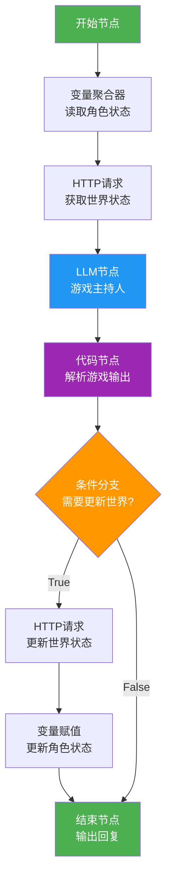

# Dify Chatflow 节点流程图

## 一、完整流程图（Mermaid）



## 二、简化流程图

```
┌─────────────────────────────────────────────────────────────────────────────────┐
│                                                                                 │
│   ┌──────────┐      ┌──────────┐      ┌──────────┐      ┌──────────┐           │
│   │  开始    │ ───► │ 变量聚合 │ ───► │ HTTP请求 │ ───► │   LLM    │           │
│   │  节点    │      │   器     │      │(获取状态)│      │  节点    │           │
│   └──────────┘      └──────────┘      └──────────┘      └──────────┘           │
│                                                                                 │
│                                                          │                      │
│                                                          ▼                      │
│                                                   ┌──────────┐                 │
│                                                   │  代码    │                 │
│                                                   │  节点    │                 │
│                                                   └──────────┘                 │
│                                                          │                      │
│                                                          ▼                      │
│                                                   ┌──────────┐                 │
│                                                   │ 条件分支 │                 │
│                                                   └──────────┘                 │
│                                                     │        │                 │
│                                          ┌──────────┘        └──────────┐      │
│                                          │ True                 False   │      │
│                                          ▼                              ▼      │
│                                   ┌──────────┐                   ┌──────────┐  │
│                                   │ HTTP请求 │                   │   结束   │  │
│                                   │(更新状态)│                   │   节点   │  │
│                                   └──────────┘                   └──────────┘  │
│                                          │                              ▲      │
│                                          ▼                              │      │
│                                   ┌──────────┐                          │      │
│                                   │ 变量赋值 │ ─────────────────────────┘      │
│                                   └──────────┘                                 │
│                                                                                 │
└─────────────────────────────────────────────────────────────────────────────────┘
```

## 三、详细节点说明图

```
┌─────────────────────────────────────────────────────────────────────────────────────┐
│                                                                                     │
│  ┌─────────────────────────────────────────────────────────────────────────────┐    │
│  │ 【节点1】开始节点                                                           │    │
│  │ ─────────────────────────────────────────────────────────────────────────── │    │
│  │ 输入：sys.query（用户输入的文本）                                           │    │
│  └─────────────────────────────────────────────────────────────────────────────┘    │
│                                          │                                          │
│                                          ▼                                          │
│  ┌─────────────────────────────────────────────────────────────────────────────┐    │
│  │ 【节点2】变量聚合器 - 读取角色状态                                          │    │
│  │ ─────────────────────────────────────────────────────────────────────────── │    │
│  │ 输入变量（会话变量）：                                                      │    │
│  │   • player_name（玩家名称）                                                │    │
│  │   • hp（生命值）                                                           │    │
│  │   • san（理智值）                                                          │    │
│  │   • current_location（当前位置）                                           │    │
│  │   • inventory（携带物品）                                                  │    │
│  │   • is_dead（死亡标志）                                                    │    │
│  │   • is_crazy（疯狂标志）                                                   │    │
│  │ 输出：role_state                                                           │    │
│  └─────────────────────────────────────────────────────────────────────────────┘    │
│                                          │                                          │
│                                          ▼                                          │
│  ┌─────────────────────────────────────────────────────────────────────────────┐    │
│  │ 【节点3】HTTP请求 - 获取世界状态                                            │    │
│  │ ─────────────────────────────────────────────────────────────────────────── │    │
│  │ 方法：GET                                                                  │    │
│  │ URL：http://你的后端地址/world-state                                       │    │
│  │ 输出：world_state（包含任务列表、氛围值、留言）                             │    │
│  └─────────────────────────────────────────────────────────────────────────────┘    │
│                                          │                                          │
│                                          ▼                                          │
│  ┌─────────────────────────────────────────────────────────────────────────────┐    │
│  │ 【节点4】LLM节点 - 游戏主持人                                               │    │
│  │ ─────────────────────────────────────────────────────────────────────────── │    │
│  │ 模型：GPT-4o 或 Claude 3.5 Sonnet                                          │    │
│  │ 输入：                                                                      │    │
│  │   • 系统提示词（含角色状态、世界状态、游戏规则）                            │    │
│  │   • 用户消息：{{sys.query}}                                                │    │
│  │ 输出：游戏回复（含检定结果、状态变化、剧情、世界更新指令）                  │    │
│  └─────────────────────────────────────────────────────────────────────────────┘    │
│                                          │                                          │
│                                          ▼                                          │
│  ┌─────────────────────────────────────────────────────────────────────────────┐    │
│  │ 【节点5】代码节点 - 解析游戏输出                                            │    │
│  │ ─────────────────────────────────────────────────────────────────────────── │    │
│  │ 语言：Python3                                                              │    │
│  │ 输入：llm_output（LLM的输出）                                              │    │
│  │ 输出：                                                                     │    │
│  │   • need_update（Boolean）- 是否需要更新世界状态                           │    │
│  │   • update_data（Object）- 世界更新数据                                    │    │
│  │   • hp_change（Number）- HP变化值                                          │    │
│  │   • san_change（Number）- SAN变化值                                        │    │
│  │   • clean_output（String）- 给玩家看的回复                                 │    │
│  │   • new_location（String）- 新位置（如有变化）                             │    │
│  └─────────────────────────────────────────────────────────────────────────────┘    │
│                                          │                                          │
│                                          ▼                                          │
│  ┌─────────────────────────────────────────────────────────────────────────────┐    │
│  │ 【节点6】条件分支 - 检查世界更新                                            │    │
│  │ ─────────────────────────────────────────────────────────────────────────── │    │
│  │ 条件：{{need_update}} == true                                              │    │
│  │                                                                             │    │
│  │   ┌─────────────────┐          ┌─────────────────┐                          │    │
│  │   │   True 分支     │          │   False 分支    │                          │    │
│  │   │   (需要更新)    │          │   (无需更新)    │                          │    │
│  │   └────────┬────────┘          └────────┬────────┘                          │    │
│  └────────────┼────────────────────────────┼────────────────────────────────────┘    │
│               │                            │                                        │
│               ▼                            ▼                                        │
│  ┌─────────────────────────┐    ┌─────────────────────────┐                        │
│  │ 【节点7】HTTP请求       │    │ 【节点9】结束节点       │                        │
│  │ 更新世界状态            │    │ 输出回复给玩家          │                        │
│  │ ─────────────────────── │    │ ─────────────────────── │                        │
│  │ 方法：POST              │    │ 输出：{{clean_output}}  │                        │
│  │ URL：.../update-world   │    └─────────────────────────┘                        │
│  │ Body：{{update_data}}   │                       ▲                                │
│  └───────────┬─────────────┘                       │                                │
│              │                                     │                                │
│              ▼                                     │                                │
│  ┌─────────────────────────┐                      │                                │
│  │ 【节点8】变量赋值       │ ─────────────────────┘                                │
│  │ 更新角色状态            │                                                        │
│  │ ─────────────────────── │                                                        │
│  │ hp = {{hp + hp_change}} │                                                        │
│  │ san = {{san + san_change}}                                                       │
│  │ location = {{...}}      │                                                        │
│  └─────────────────────────┘                                                        │
│                                                                                     │
└─────────────────────────────────────────────────────────────────────────────────────┘
```

## 四、数据流向图

```
┌─────────────────────────────────────────────────────────────────────────────────────┐
│                              数据流向示意图                                          │
└─────────────────────────────────────────────────────────────────────────────────────┘

     用户输入                                                    用户看到的回复
        │                                                             ▲
        ▼                                                             │
   ┌─────────┐                                                  ┌─────────┐
   │ sys.query│                                                  │  answer │
   └────┬────┘                                                  └────▲────┘
        │                                                             │
        ▼                                                             │
┌───────────────────────────────────────────────────────────────────────────────────┐
│                                                                                   │
│  会话变量                    节点处理过程                   会话变量更新           │
│  ┌─────────┐                                                    ┌─────────┐       │
│  │player_name│ ──────►  变量聚合器  ──────►  LLM节点  ──────►  │player_name│       │
│  │hp: 100   │                  │              │                 │hp: 85    │       │
│  │san: 100  │                  ▼              ▼                 │san: 90   │       │
│  │location  │           HTTP请求节点    代码节点解析            │location  │       │
│  │inventory │           (获取世界状态)  (提取状态变化)          │inventory │       │
│  │is_dead   │                  │              │                 │is_dead   │       │
│  │is_crazy  │                  ▼              ▼                 │is_crazy  │       │
│  └─────────┘            world_state    hp_change: -15          └─────────┘       │
│                         atmosphere: 50  san_change: -10                           │
│                         tasks: [...]    clean_output: "..."                       │
│                         messages: [...]                                           │
│                              │                          │                          │
│                              ▼                          ▼                          │
│                       ┌─────────────┐            ┌─────────────┐                   │
│                       │  条件分支   │            │  变量赋值   │                   │
│                       └──────┬──────┘            └─────────────┘                   │
│                              │                                                     │
│                    ┌─────────┴─────────┐                                           │
│                    ▼                   ▼                                           │
│             ┌──────────┐        ┌──────────┐                                      │
│             │  True    │        │  False   │                                      │
│             │  需要更新│        │  无需更新│                                      │
│             └────┬─────┘        └────┬─────┘                                      │
│                  │                   │                                             │
│                  ▼                   │                                             │
│           ┌──────────┐              │                                             │
│           │HTTP请求  │              │                                             │
│           │(更新状态)│              │                                             │
│           └────┬─────┘              │                                             │
│                │                    │                                             │
│                ▼                    │                                             │
│         ┌──────────┐               │                                             │
│         │变量赋值  │               │                                             │
│         │(更新HP等)│               │                                             │
│         └────┬─────┘               │                                             │
│              │                     │                                             │
│              └──────────┬──────────┘                                             │
│                         ▼                                                         │
│                  ┌──────────┐                                                     │
│                  │  结束    │                                                     │
│                  │  节点    │                                                     │
│                  └──────────┘                                                     │
│                                                                                   │
└───────────────────────────────────────────────────────────────────────────────────┘
```

## 五、简化版流程（适合演示）

```
                    ┌──────────────────────┐
                    │      开始游戏        │
                    │   用户输入名称       │
                    └──────────┬───────────┘
                               │
                               ▼
                    ┌──────────────────────┐
                    │    读取玩家状态      │
                    │  HP:100 SAN:100     │
                    │  位置:小镇入口       │
                    └──────────┬───────────┘
                               │
                               ▼
                    ┌──────────────────────┐
                    │   获取世界状态       │
                    │  氛围:50 任务:3个    │
                    └──────────┬───────────┘
                               │
                               ▼
                    ┌──────────────────────┐
                    │   AI游戏主持人       │
                    │  分析行动/判定检定   │
                    │  生成剧情描述        │
                    └──────────┬───────────┘
                               │
                               ▼
                    ┌──────────────────────┐
                    │   解析AI输出         │
                    │  提取状态变化        │
                    │  提取世界更新        │
                    └──────────┬───────────┘
                               │
                               ▼
                    ┌──────────────────────┐
                    │   需要更新世界?      │
                    └──────────┬───────────┘
                               │
              ┌────────────────┴────────────────┐
              │                                 │
              ▼                                 ▼
    ┌──────────────────┐              ┌──────────────────┐
    │    更新世界状态   │              │    跳过更新      │
    │  (任务/氛围/留言) │              │                  │
    └────────┬─────────┘              └────────┬─────────┘
             │                                 │
             ▼                                 │
    ┌──────────────────┐                       │
    │   更新玩家状态   │                       │
    │   HP/SAN/位置    │                       │
    └────────┬─────────┘                       │
             │                                 │
             └────────────────┬────────────────┘
                              │
                              ▼
                   ┌──────────────────────┐
                   │   输出游戏回复       │
                   │   给玩家看到         │
                   └──────────┬───────────┘
                              │
                              ▼
                   ┌──────────────────────┐
                   │   等待下一次输入     │
                   │   循环继续游戏       │
                   └──────────────────────┘
```

## 六、节点连接顺序

```
开始节点
    │
    │ 连接
    ▼
变量聚合器
    │
    │ 连接
    ▼
HTTP请求（获取世界状态）
    │
    │ 连接
    ▼
LLM节点（游戏主持人）
    │
    │ 连接
    ▼
代码节点（解析输出）
    │
    │ 连接
    ▼
条件分支
    │
    ├───────────────────────┐
    │ True                  │ False
    ▼                       ▼
HTTP请求（更新世界状态）    │
    │                       │
    │ 连接                  │
    ▼                       │
变量赋值（更新角色状态）    │
    │                       │
    │ 连接                  │
    └───────────────────────┘
              │
              ▼
         结束节点
```
